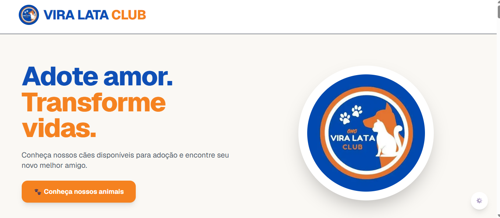

# 🐾 Vira Lata Club

A real-world web platform built for **Vira Lata Club**, an animal-rescue NGO in Brazil.

It turns the NGO's existing Google Sheets and Google Drive workflow into an adoption catalogue kept up to date through synchronization, helping animals gain visibility while reducing repetitive operational work for volunteers.

> Built for a real animal-rescue organization.

## Live application

**[Visit Vira Lata Club →](https://animais-viralataclub.vercel.app/)**



## The problem

Before the platform, the NGO's adoption catalogue was largely managed through spreadsheets, Google Drive folders and direct conversations on Instagram and WhatsApp.

When someone asked about animals available for adoption, volunteers often had to search for information and photos manually and send them individually.

The platform was created to turn that existing operational data into a synchronized public catalogue — without forcing volunteers to abandon the tools they already use.

The result is a public experience that makes animals easier to discover while keeping the NGO's operational workflow familiar and simple.

## Features

### Public catalogue

- Responsive catalogue of animals available for adoption.
- Search by name and filters by sex and size.
- Individual animal pages with health, behaviour, sociability and rescue information.
- Responsive image gallery.
- Direct link to the adoption form.

### Sharing

- WhatsApp sharing.
- Copyable animal-page links.
- Story-sized visual generated for sharing through the Web Share API on supported mobile browsers.
- Dynamic Open Graph image and metadata for each animal page.

### Administration and synchronization

- Authenticated admin area to manage animal records and images.
- Import and export of XLSX files.
- Animal-data synchronization from Google Sheets using upsert by animal ID.
- Removal of records no longer present in the source spreadsheet.
- Image synchronization from Google Drive to Cloudinary.
- Batched image processing.
- Image-change detection using Google Drive file IDs and checksums.
- Preservation of image display order and main photo.
- Structured logs for synchronization operations.

## Tech stack

- **Frontend:** Next.js, React, TypeScript, Tailwind CSS, Next/Image.
- **Framework architecture:** Next.js App Router.
- **Data and authentication:** Supabase and PostgreSQL.
- **Integrations:** Google Sheets API, Google Drive API and Cloudinary.
- **Spreadsheet processing:** SheetJS (`xlsx`).
- **Sharing:** Next.js `ImageResponse`, Web Share API and WhatsApp URL sharing.
- **Deployment:** Vercel.

## Architecture

The application is organized around Next.js routes, domain modules and reusable infrastructure.

The tree below reflects the **current structure of the project**, including folders that are still being migrated toward the modular architecture.

```text
src/
├── app/                         # Next.js routes, layouts, route handlers and server actions
│   ├── actions/
│   ├── admin/
│   ├── animais/
│   ├── api/
│   └── login/
│
├── modules/                     # Domain-oriented application code
│   ├── admin/
│   │
│   ├── animals/
│   │   ├── actions/
│   │   ├── components/
│   │   ├── mappers/
│   │   ├── repositories/
│   │   ├── services/
│   │   ├── types/
│   │   └── utils/
│   │
│   ├── auth/
│   │   ├── actions/
│   │   ├── components/
│   │   └── services/
│   │
│   └── sync/
│       ├── hooks/
│       ├── mappers/
│       ├── repositories/
│       ├── services/
│       ├── types/
│       └── utils/
│
├── shared/                      # Cross-domain infrastructure and reusable code
│   ├── components/
│   ├── config/
│   ├── integrations/
│   │   ├── cloudinary/
│   │   ├── google-drive/
│   │   ├── google-sheets/
│   │   └── supabase/
│   ├── lib/
│   └── logger/
│
├── components/                  # Legacy/shared UI, migrated incrementally
├── data/
├── hooks/
├── lib/
├── mappers/
└── types/
```

Some earlier global folders coexist with the modular structure during an incremental migration.

New domain-specific code should be added to its respective module, while code reused across domains belongs in `shared`.

## Synchronization flow

The NGO continues managing its operational data through familiar Google tools.

The application acts as the integration layer between those tools and the public adoption catalogue.

```text
Google Sheets
      │
      │ Animal data
      ▼
Animal synchronization
      │
      ▼
Supabase / PostgreSQL
      │
      ▼
Next.js catalogue
```

Images are processed independently:

```text
Google Drive
      │
      │ Animal photos
      ▼
Batched image synchronization
      │
      ▼
Change detection
      │
      ▼
Cloudinary
      │
      ▼
Animal gallery
```

### Animal synchronization

Animal synchronization:

1. reads animal data from Google Sheets;
2. maps spreadsheet rows to the internal application model;
3. upserts records using the animal ID;
4. updates website visibility based on animal status;
5. removes database records that are no longer present in the source spreadsheet.

This keeps Google Sheets as the authoritative operational source for animal data.

### Image synchronization

Image synchronization is executed separately through the admin workflow.

The process:

1. reads animal folders from Google Drive;
2. processes animals in batches;
3. compares Drive file IDs, checksums and image order with the database;
4. uploads new or changed images to Cloudinary;
5. preserves the configured image order and main photo;
6. replaces gallery records when updated images have been successfully processed.

This avoids re-uploading every image during each synchronization.

## Engineering decisions

### Integrating with the existing NGO workflow

The NGO already manages animal information in Google Sheets and photos in Google Drive.

Instead of introducing a completely new administrative system, the application was designed around those existing tools.

This reduces operational friction for volunteers while allowing the public website to remain structured and up to date through synchronization.

### Incremental image synchronization

Animal galleries can contain a large number of images.

Re-uploading every file during each synchronization would increase execution time and unnecessary Cloudinary operations.

The synchronization process therefore compares Google Drive file IDs and checksums to determine whether an image has actually changed before processing it.

### Batched processing

Image synchronization can involve hundreds of files and may exceed the execution time available to a single serverless request.

The image workflow is therefore processed in batches through the admin interface.

This allows large synchronization jobs to progress incrementally without depending on a single long-running request.

### Data consistency

Animal data and image synchronization are handled as separate concerns.

Gallery records are updated only after image processing succeeds, reducing the chance of leaving an animal page with incomplete image data after a failed synchronization.

### Dynamic social sharing

Each animal page can generate its own social-sharing assets.

The application uses Next.js `ImageResponse` to generate Open Graph and story-sized visuals containing dynamic information such as:

- animal name;
- sex;
- size;
- estimated age;
- health information;
- rescue story;
- adoption call-to-action.

This makes shared animal pages more recognizable and useful on social platforms.

## Getting started

### Requirements

Make sure you have:

- Node.js 20 or later;
- npm;
- a Supabase project;
- Google service-account access to the configured spreadsheet;
- Google Drive access to the configured animal folders;
- a Cloudinary account.

### Clone the repository

```bash
git clone https://github.com/luana-caboz/animais-viralataclub.git
cd animais-viralataclub
```

### Install dependencies

```bash
npm install
```

### Configure environment variables

Create `.env.local` from `.env.example`.

#### macOS / Linux / Git Bash

```bash
cp .env.example .env.local
```

#### Windows Command Prompt

```cmd
copy .env.example .env.local
```

#### PowerShell

```powershell
Copy-Item .env.example .env.local
```

Fill in the required environment variables before starting the application.

### Start the development server

```bash
npm run dev
```

Open:

```text
http://localhost:3000
```

## Environment variables

The project uses environment variables for database access and external integrations.

```env
NEXT_PUBLIC_SUPABASE_URL=
NEXT_PUBLIC_SUPABASE_ANON_KEY=
NEXT_PUBLIC_SITE_URL=

SUPABASE_SERVICE_ROLE_KEY=

CLOUDINARY_CLOUD_NAME=
CLOUDINARY_API_KEY=
CLOUDINARY_API_SECRET=

GOOGLE_PROJECT_ID=
GOOGLE_CLIENT_EMAIL=
GOOGLE_PRIVATE_KEY=

GOOGLE_DRIVE_FOLDER_ID=
GOOGLE_SHEET_ID=

# Optional: permits external automation to call POST /api/sync
SYNC_API_SECRET=
```

Never commit `.env.local` or expose:

- Supabase service-role credentials;
- Cloudinary secrets;
- Google private keys.

Production credentials should be configured directly in the deployment environment.

## Available scripts

```bash
npm run dev
```

Starts the development server.

```bash
npm run lint
```

Runs ESLint.

```bash
npm run build
```

Creates a production build.

```bash
npm run start
```

Starts the production server.

## Operational notes

### Animal synchronization

```text
POST /api/sync
```

synchronizes animal data from Google Sheets. It requires an authenticated admin session or an `Authorization: Bearer <SYNC_API_SECRET>` header when the optional secret is configured.

The spreadsheet acts as the authoritative source for synchronized animal records.

Animals removed from the spreadsheet may also be removed from the application database during synchronization.

### Image synchronization

Image synchronization is executed through the admin interface after animal-data synchronization.

Animals are processed in batches to avoid serverless execution limits.

The process uses Google Drive file metadata and checksums to identify changed images and avoid unnecessary uploads.

## Security

Administrative operations and integration credentials must remain server-side.

The synchronization endpoint verifies an administrative session or the optional `SYNC_API_SECRET` before modifying application data.

Sensitive credentials must never be exposed to the client or committed to the repository.

## Project status

The core adoption catalogue and synchronization infrastructure are operational.

Current capabilities include:

- ✅ Public animal catalogue
- ✅ Individual animal pages
- ✅ Search and filters
- ✅ Responsive animal galleries
- ✅ Google Sheets synchronization
- ✅ Google Drive synchronization
- ✅ Cloudinary integration
- ✅ Batched image processing
- ✅ Admin authentication
- ✅ XLSX import and export
- ✅ WhatsApp sharing
- ✅ Copy-link sharing
- ✅ Dynamic Open Graph images
- ✅ Story-sized sharing assets

The project continues to evolve with additional institutional and operational features.

## Roadmap

Planned improvements include:

- institutional NGO pages;
- donation information;
- transparency reports;
- project impact indicators;
- events and adoption fairs;
- additional workflow automation.

## Social impact

The project was created to support the people who dedicate their time to rescuing, caring for and finding families for animals.

Technology does not replace that work, but it can reduce the repetitive operational tasks around it.

The goal is to help animals gain more visibility, make adoption information easier to access and give volunteers more time to focus on animal care.

## Author

Developed by **Luana Caboz**.

Responsible for the application's architecture, integrations, synchronization workflows and frontend implementation.

## License

This project was developed for Vira Lata Club.

Contact the project owner before reproducing or redistributing organization-specific assets, data or branding.
